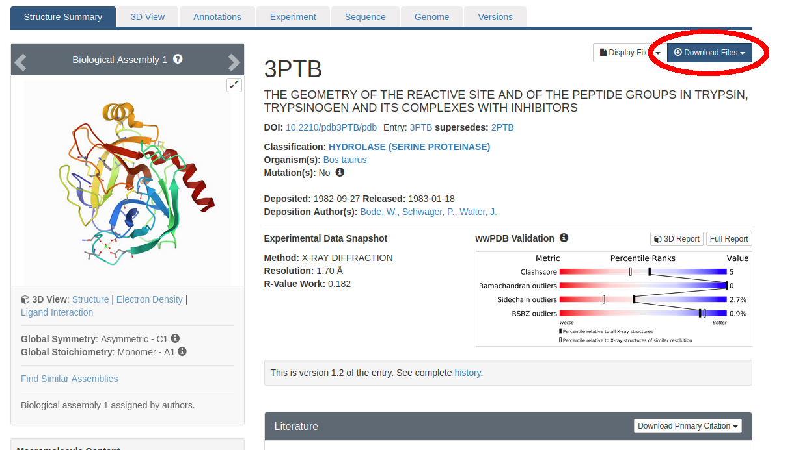
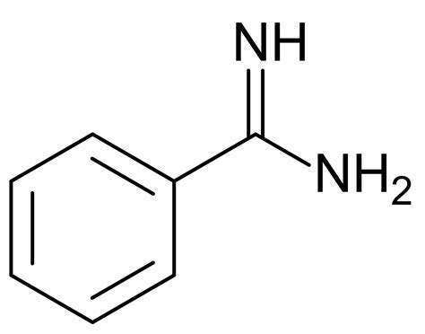
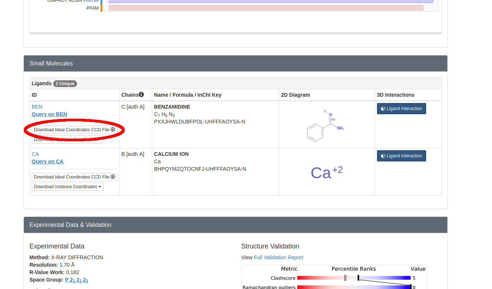
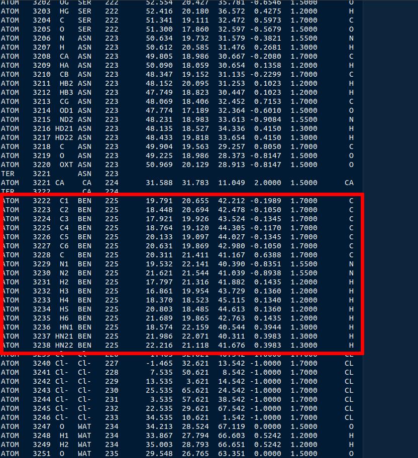
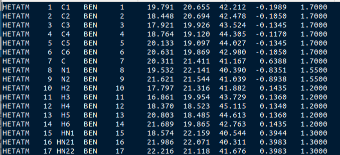

Tutorial: Parametrizing the Trypsin/Benzamidine System
======================================================

In this tutorial, we will be preparing sample SEEKR2 input files to determine
the kinetics of binding between the receptor protein **trypsin** and the ligand
molecule **benzamidine**. The parametrization will be done in the AMBER
molecular mechanics forcefield.

.. note::
  This tutorial is not a replacement for becoming proficient in using
  AmberTools. To learn how to use AmberTools, please visit the Amber Tutorials
  page at https://ambermd.org/tutorials/, review the Amber Manual at 
  https://ambermd.org/Manuals.php, or both.

Identify your System
--------------------

The first step for any SEEKR calculation is the identification of the **target**
**molecule** (in this case, trypsin). If binding kinetics is the desired
calculation (most common use of SEEKR), you must also identify at least one
**ligand molecule** (in this case, benzamidine).

Trypsin binding to benzamidine is a very common **model system** to use for 
proposed computational algorithms that seek to estimate the kinetics of 
binding and/or unbinding between two molecules in a molecular system. The
trypsin/benzamidine system is one of the first molecular systems that SEEKR 
programs were tested on (see [CIT2017]_).

This tutorial is essentially a reproduction of system preparation in our 2017
paper.

Obtain the PDB structure
------------------------

Once the target and ligand molecules have been defined, one must find Protein
Data Bank (PDB) files of the molecular structures of the two molecules, 
ideally the structure of the two *in the bound state*. Such a structure does
not, unfortunately, exist for the trypsin/benzamidine system in the PDB 
database.

Follow the link to the PDB page for trypsin/benzamidine: 
https://www.rcsb.org/structure/3PTB. We originally found this 
structure by searching for valid starting structures in scientific literature
publications and by using the PDB's own search engine.

   
   Figure 1: The Protein Data Bank entry we will use as a starting structure for
   our SEEKR2 calculations of Trypsin/Benzamidine (ID: 3PTB).
   
Click on "Download Files" near the top right (circled in red in Figure 1). Then
select "PDB Format". Save the file "3ptb.pdb" somewhere on your hard drive.

At this stage, many people will "clean" their PDB file using various tools.
For instance, the Schrödinger commercial software, if available to you, 
includes a PDB cleaner. A free alternative is MolProbity 
(http://molprobity.manchester.ac.uk/). 

.. note::
  This process has been greatly simplified for demonstration purposes. When
  preparing your own system for a SEEKR2 calculation, many other procedures
  should be observed, including, for instance, **assigning the correct
  protonation states to histidine residues**. You should either consult an
  expert at preparing molecular dynamics (MD) simulations, or become an
  expert yourself before proceeding with your own system(s) of interest.
  
Since LEAP will not be able to handle the structure 3ptb.pdb as-is, and 
that structure doesn't represent the bound state, we've
provided a processed PDB file that you can download and proceed with:

Download :download:`3ptb_processed.pdb <media/3ptb_processed.pdb>`.

This PDB has benzamidine in the bound state, which was obtained from one of
our earlier SEEKR papers (see [CIT2017]_).

.. note::
  What should you do if your PDB does not have the ligand in the bound state?
  The automated software to handle this situation is under active development by 
  the SEEKR team. However, at this time, you will need to use the so-called
  "ratchet method" to bring the ligand into the bound state using SEEKR2 
  itself. There is no tutorial for how to perform the ratchet method, though
  with enough interest, the SEEKR team may be persuaded to move it higher
  on the priority list.

Use Antechamber to Parametrize Ligand
-------------------------------------

SEEKR is often run on systems that contain at least one small molecule, which
must be parametrized. One way to do this is with the Antechamber program in
AmberTools.

Here, we will use Antechamber to parametrize our ligand: the small molecule 
benzamidine.

   
   Figure 2: Benzamidine

Antechamber requires a *CIF* file to parametrize the small molecule. Return to
the PDB page at https://www.rcsb.org/structure/3PTB for the trypsin/benzamidine 
system, and scroll down until you see the "Small Molecules" section. Click 
"Download Ideal Coordinates CCD File".

   
   Figure 3: Download the CIF file.
   
Save BEN.cif somewhere on your hard drive. This molecule contains optimized
molecular geometries and missing hydrogens.

Next, see if you have Antechamber::

  which antechamber

If this returns a path, you should be good. Otherwise, you'll need to install 
AmberTools. If antechamber exists on your computer, run the following command::

  antechamber -i BEN.cif -fi ccif -bk BEN -o benz.mol2 -fo mol2 -c bcc -nc 1

Each argument means the following information:

**-i BEN.cif** - Take the BEN.cif file as input.

**-fi ccif** - The format of BEN.cif is in ccif (CIF) format.

**-bk BEN** - The component/block ID for benzamidine in the CIF file is "BEN".

**-o benz.mol2** - Specify output file name of benzamidine molecule.

**-fo mol2** - Output the benz.mol2 file in MOL2 format.

**-c bcc** - Use the AM1-BCC semi-empirical method to assign partial charges
of the atoms.

**-nc 1** - This molecule has a net molecular charge of +1 due to its 
protonation state in aqueous environments at pH 7.

.. note::
  Semi-empirical methods for assigning charges are quick and easy, but are
  probably one of the least accurate methods for assigning partial charges
  to a molecule. For your own molecules, consider looking into more accurate 
  levels of quantum calculations to obtain partial charges such as Hartree Fock 
  with Density Function Theory (HF-DFT) or Møller-Plesset 2 (MP2). These types 
  of calculations involving "higher" levels of quantum theory must be done with
  quantum calculation software such as Gaussian or GAMESS. Incorporation of
  parameters from quantum calculation software is a subject beyond the scope of 
  this tutorial.

Use the parmchk2 program to generate a frcmod file, which LEAP will need to
create the bound system::

  parmchk2 -i benz.mol2 -f mol2 -o benz.frcmod
  
Then, generate a ".lib" file which will contain a library of forcefield 
parameters for the benzamidine molecule. Enter the following commands into 
the terminal::
  
  tleap
  source leaprc.gaff
  BEN = loadmol2 benz.mol2
  saveoff BEN benz.lib
  quit

Use LEAP to Create the Forcefield Parameters for the Solvated System
--------------------------------------------------------------------

If you haven't yet downloaded
:download:`3ptb_processed.pdb <media/3ptb_processed.pdb>`, please do so now.

Now with a text editor, copy the following script to a file named **leaprc**::

  source leaprc.protein.ff14SB
  source leaprc.gaff
  source leaprc.water.tip4pew
  set default PBRadii mbondi2
  loadoff benz.lib
  loadamberparams benz.frcmod
  WAT = T4E
  HOH = T4E
  loadAmberParams frcmod.ionsjc_tip4pew
  loadAmberParams frcmod.tip4pew
  mol = loadpdb 3ptb_processed.pdb
  solvateoct mol TIP4PEWBOX 8
  addIons2 mol Cl- 0
  saveamberparm mol tryp_ben.prmtop tryp_ben.inpcrd
  savepdb mol tryp_ben.pdb
  check mol
  charge mol
  quit

Then, run LEAP with the following command::

  tleap -f leaprc

Let us consider a few key lines within this LEAP script:

**source leaprc.protein.ff14SB** - We are using the Amber14 protein parameters,
which is one of the most recently generated parameter sets, and seems to perform
quite well in SEEKR.

**source leaprc.water.tip4pew** - We are using the TIP4Pew water model, which,
in theory, should be more accurate than the TIP3P water model.

**set default PBRadii mbondi2** - The Born radii must be set in order to 
generate PQR files at a later step.

**solvateoct mol TIP4PEWBOX 8** - We choose to use a **solvated octahedron**
instead of a **solvated box**. This is because truncated octahedra are a more
efficient use of space - less water molecules will be required to isolate the 
solute molecules from their periodic images. In fact, using an octahedron 
instead of a box usually cuts the number of water molecules in half, 
dramatically speeding up the simulations. We also create a buffer of 8 Angstroms
around the protein. This number should be sufficiently large, but you could 
increase to 10 or even 12 if you want to be extra safe.

**addIons2 mol Cl- 0** - Since this system is positively charged, this command
will add chloride counterions until the system is neutrally charged. When 
consulting the publication that measured the kinetics of trypsin/benzamidine
binding experimentally, we found that the system should contain a low 
concentration of calcium chloride and other buffers. Due to the low 
concentrations and difficulty of dealing with divalent ions in solution, we
elected to merely add these counterions, with no additional ions mentioned in
the publication. However, in general, it is a good idea to carefully consider
your ions to recreate experimental or physiological conditions closely, if
possible.

If everything runs correctly, the files **tryp_ben.prmtop** and 
**tryp_ben.inpcrd** should be generated. 

.. note::
  The tryp_ben.prmtop and tryp_ben.inpcrd files are essentially equivalent to 
  those which exist in the SEEKR2 github repository at 
  https://github.com/seekrcentral/seekr2.git located in 
  seekr2/seekr2/data/trypsin_benzamidine_files/mmvt. However, since better
  practices were used in the preparation of the parameter/topology and 
  coordinate files in the git repository, you should use those files for any
  production calculations, NOT the files generated in this tutorial.

Create the PQR files used in Brownian Dynamics
----------------------------------------------

The final step, once you have parametrized your system, is to create the PQR
files which will be used by the Brownian dynamics software to compute the
binding rate constant (k-on).

AmberTools has a program for this purpose named **ambpdb**. Run the following
command::

  ambpdb -p tryp_ben.prmtop -c tryp_ben.inpcrd -pqr > tryp_ben_all.pqr

You can run ``ambpdb -h`` for an explanation of these arguments.

This will create a PQR file, which is almost identical to a PDB file, 
although instead of having a *beta* and *occupancy* column, the last two
columns of the file represent the *charge* and *radius* of each atom.

Open the file **tryp_ben_all.pqr** in a text editor (like vim, emacs, or
gedit).

Scroll way down until you find the **BEN** residue name (or perform a search in
the document)

   
   Figure 4: The BEN residue in the tryp_ben_all.pqr file.
   
Select all atoms with the BEN residue name and copy them over into a new file.
Name that file **tryp_ben_ligand_one_resid.pqr**. The reason for this name
will become clear in a moment.

.. figure:: media/tutorial_tryp_ben_pqr_ligand_one_resid.png
   :align:  center
   
   Figure 5: The BEN residue in the tryp_ben_pqr_one_resid.pqr file. Notice
   that the atom index and residue numbering are incorrect. We will correct
   these momentarily.
  
Next, back in tryp_ben_all.pqr, select the entire protein (all atoms *above*
the BEN residue, including the calcium ion, since it is bound to the protein) 
and copy them over to a new file. Name that file **tryp_ben_receptor.pqr**. 
This new file will *not* have the BEN residue nor any water molecules in it.

.. note::
  You should delete all lines in the PQRs that don't begin with ATOM or HETATM. 
  Browndye will have trouble with lines that begin with other words, such as 
  TER or CRYST.

Now back to the file named **tryp_ben_ligand_one_resid.pqr**. Notice that this
file has incorrect atom and residue numbering. More importantly, there is a
feature of Browndye (the Brownian dynamics software that SEEKR2 uses) which
lumps all charges of a residue into the same point (test charge). This may
be fine for a protein such as in the file **tryp_ben_receptor.pqr**, but for
a small molecule like benzamidine, we can improve accuracy by considering the
point charges on each atom. This is accomplished by numbering each atom with
a different residue number.

A script performs this automatically within Seekrtools, named 
**pqr_resid_for_each_atom.py**::

  python /PATH/TO/seekrtools/seekrtools/pqr_resid_for_each_atom.py \
  tryp_ben_ligand_one_resid.pqr tryp_ben_ligand.pqr

Obviously, change "/PATH/TO/seekrtools" to the actual path to your own instance
of the Seekrtools git repository.

Now, open the file named **tryp_ben_ligand.pqr**. You will see that it is
numbered correctly, with each atom assigned its own residue number.

   
   Figure 6: The atoms within this benzamidine PQR file are numbered correctly.
   The different residue numbers for each atom enhances accuracy in the
   Brownian dynamics calculations.

Now, the system is parametrized and ready for equilibration. You may proceed
to the next tutorial.

Download any Missing Files
--------------------------

If anything went wrong with any steps above, you can download the files below
to use for later tutorials.

:download:`tryp_ben.prmtop <media/tryp_ben.prmtop>`

:download:`tryp_ben.inpcrd <media/tryp_ben.inpcrd>`

:download:`tryp_ben.pdb <media/tryp_ben.pdb>`

:download:`tryp_ben_receptor.pqr <media/tryp_ben_receptor.pqr>`

:download:`tryp_ben_ligand.pqr <media/tryp_ben_ligand.pqr>`

.. [CIT2017]
   Votapka LW, Jagger BR, Heyneman AL, Amaro RE. 
   SEEKR: Simulation Enabled Estimation of Kinetic Rates, A Computational Tool 
   to Estimate Molecular Kinetics and Its Application to Trypsin-Benzamidine 
   Binding. 
   J Phys Chem B. 
   2017 Apr 20;121(15):3597-3606. 
   doi: 10.1021/acs.jpcb.6b09388. 
   Epub 2017 Mar 3. PMID: 28191969; PMCID: PMC5562489.