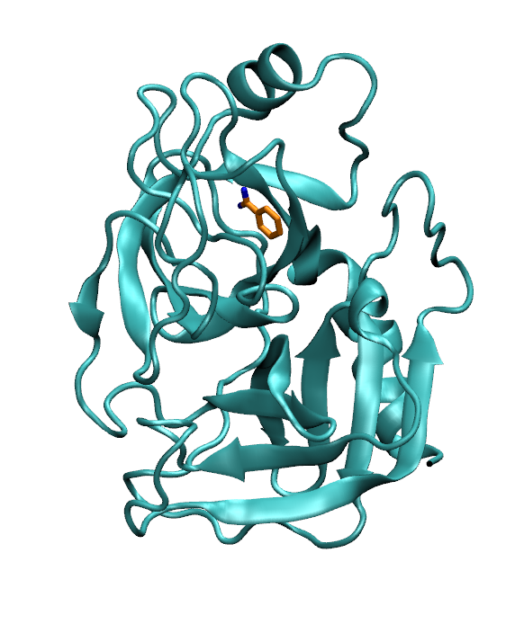

Tutorials for Preparing the Trypsin/Benzamidine System
======================================================

This tutorial walks through the process of preparing, parametrizing, 
equilibrating, and generating the starting structures for a SEEKR2 calculation
of the trypsin/benzamidine system.

This tutorial requires OpenMM and AmberTools to be installed and ready to run.

   
   A structure of benzamidine bound to the trypsin protein.

.. toctree::
   :maxdepth: 1
   :caption: Contents:

   tutorial_tryp_ben_parametrize
   tutorial_tryp_ben_hidr
